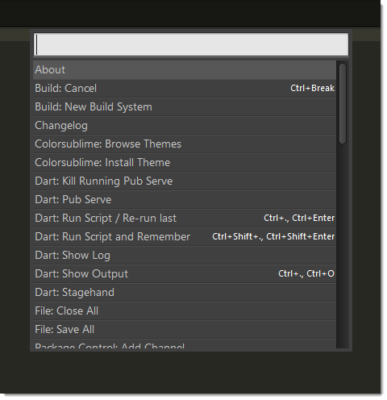

===============
命令面板
===============

.. seealso::
  
   :doc:`命令面板参考文档 <../reference/command_palette>`
      有关命令面板选项的完整文档。

概述
========

*命令面板* 是一个绑定到键盘 `Ctrl+Shift+P` 的交互列表，其目的在意执行命令。命令面板
与命令文件相互联系。通常，命令不保证产生一个按键绑定，可以在 ``.sublime-commands``
中作为一些很好的候选。

  命令面板
默认情况下，命令面板包含许多有用的命令，可以方便地访问各个设置以及设置文件。

要使用命令面板：

1. 按下 ``Ctrl+Shift+P`` 。
2. 选择一个命令
3. 按下 ``Enter``。

命令面板通过文本过滤选项。这意味着无论何时打开它，您都不会总是看到每个 ``.sublime-commands`` 文件中定义的所有命令。

``.sublime-commands`` 文件的示例
=================================
以下是 ``Packages/Default/Default.sublime-commands`` 的摘录::

   [
       { "caption": "Project: Save As", "command": "save_project_as" },
       { "caption": "Project: Close", "command": "close_project" },
       { "caption": "Project: Add Folder", "command": "prompt_add_folder" },
   
       { "caption": "Preferences: Default File Settings", "command": "open_file", "args": {"file": "${packages}/Default/Base File.sublime-settings"} },
       { "caption": "Preferences: User File Settings", "command": "open_file", "args": {"file": "${packages}/User/Base File.sublime-settings"} },
       { "caption": "Preferences: Default Global Settings", "command": "open_file", "args": {"file": "${packages}/Default/Global.sublime-settings"} },
       { "caption": "Preferences: User Global Settings", "command": "open_file", "args": {"file": "${packages}/User/Global.sublime-settings"} },
       { "caption": "Preferences: Browse Packages", "command": "open_dir", "args": {"dir": "$packages"} }
   ]