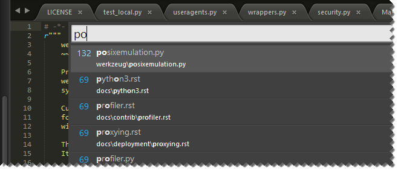
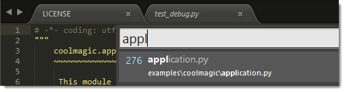

=================
文件导航
=================

.. _fm-goto-anything:

随意跳转（Goto Anything）
=============

使用随意跳转，你可以快速浏览项目的文件。

与随意跳转相关的键盘快捷键：

+------------------------+------------------------+
| **Open Goto Anything** | Ctrl + P               |
+------------------------+------------------------+
| Pin current item and   | Enter                  |
| close Goto Anything    |                        |
+------------------------+------------------------+
| Pin current item       | →                      |
+------------------------+------------------------+
| Close Goto Anything    | Esc                    |
+------------------------+------------------------+

当你在随意跳转输入区域中进行输入时，将搜索当前项目中的文件名称，并显示最佳匹配的预览。此预览是 *瞬态的*；也就是说，在对它执行某些操作之前，它不会成为实际的活动视图。你会在其他情况下找到瞬态视图，例如，在单击侧边栏中的文件后。

“随意跳转”正如其名，其功能不仅限于查找文件。

随意跳转操作项
***********************

随意跳转接受几个操作项。所有这些都可以单独使用或在搜索后使用。

例如::

	models:100

这指示Sublime Text首先搜索路径与 ``models`` 匹配的文件，然后转到所述文件中的第100行。

支持的操作项
-------------------

.. _fm-goto-symbol:

:samp:`@{symbol}`
    在活动文件中搜索名为 ``symbol`` 的符号。

    .. note::

        符号通常包括类和函数名称。

        如果活动文件类型具有为其定义的符号，则符号搜索将仅产生结果。符号在 ``.tmLanguage`` 文件中定义。有关符号的更多信息，请参阅 :doc:`../reference/symbols`。

..    See *Symbols - Syntax Preferences*
..    (TODO: to be added).

:samp:`#{term}`
    对 ``term`` 搜索词进行模糊搜索并突出显示所有匹配项。

:samp:`:{line_number}`
    跳转到指定的 ``line_number``，如果 ``line_number`` 大于文件的行数，则跳转到文件的末尾。

随意跳转操作项绑定了以下快捷键：

+--------+-----------+
| **@**  | Ctrl + R  |
+--------+-----------+
| **#**  | Ctrl + ;  |
+--------+-----------+
| **:**  | Ctrl + G  |
+--------+-----------+

.. _fm-sidebar:

侧边栏
=======

侧边栏可以提供一个项目的概览视图。添加到侧边栏的文件和目录均可以通过“随意跳转”功能访问，并且响应项目范围内的指令。项目与侧边栏是密切相关的。不管以显式或是隐式的方式，总是有一个项目存在于侧边栏中。

侧边栏通过其上下文菜单提供基本文件管理操作。

这些是与侧栏相关的常见键盘快捷键：

+----------------------------------+-----------------------+
| **Toggle side bar**              | Ctrl + K, Ctrl + B    |
+----------------------------------+-----------------------+
| Give the focus to the side bar   | Ctrl + 0              |
+----------------------------------+-----------------------+
| Return the focus to the view     | Esc                   |
+----------------------------------+-----------------------+
| Navigate side bar                | Arrow keys            |
+----------------------------------+-----------------------+

从侧边栏打开的文件会创建 *半瞬态视图*。与瞬态视图不同，半瞬态视图显示为新选项卡。半瞬态视图的选项卡标题以斜体显示。在打开新的半瞬态视图之前，同一窗格中的任何其他预先存在的半瞬态视图将自动关闭。

这是一个显示普通视图，瞬态视图和半瞬态视图的示例。请注意，瞬态视图没有选项卡：

窗格
=====

窗格是一组视图。在Sublime Text中，您可以同时打开多个窗格。

与窗格相关的主要键盘快捷键：

+-----------------------+--------------------+
| Create new pane       | Ctrl+K, Ctrl+↑     |
+-----------------------+--------------------+
| Close active pane     | Ctrl+K, Ctrl+↓     |
+-----------------------+--------------------+

可以在 **View → Layout** 和相关子菜单下找到更多窗格管理命令。
