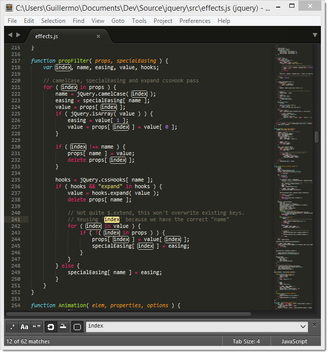

========================
关于本文档
========================

欢迎来到Sublime Text编辑器的非官方文档！

`Sublime Text`_ 是一款为编写代码和文稿而准备的多功能编辑器。它能为你做很多重复性的工作，从而让你的精力更专注在编写的内容上面。更重要的是，它会给你带来愉悦感！它适用于OS X，Windows和Linux。

在你继续阅读之前，我们鼓励你通读一下 :doc:`基本概念 <basic_concepts>` 章节。

学的开心哦！

贡献文档
=========
如果您想参与此文档，请转到 `GitHub仓库`_。本指南是使用 `Sphinx`_ 创建的。

.. _Sublime Text: http://www.sublimetext.com
.. _GitHub仓库: https://github.com/void-main/UnofficialDocs
.. _Sphinx: http://sphinx-doc.org/