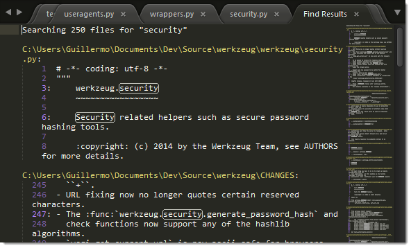

===================================
搜索与替换 - 多文件
===================================

.. _snr-search-files:
用于搜索多个文件的搜索面板称为“**在文件中查找**”。

搜索
=========

使用 ``Ctrl + Shift + F`` 键可以打开多文件搜索面板。搜索面板与搜索动作可以使用快捷键进行操作：

==========================  ===========
开/关正则表达式选项           ``Alt + R``
开/关大小写敏感选项           ``Alt + C``
开/关精确匹配选项             ``Alt + W``
查找下一个                   ``Enter``
==========================  ===========

.. _snr-search-scope-files:

搜索作用域
============

搜索面板中的 **Where** 字段决定搜索文件的范围。你可以通过以下几种方式来确定文件的搜索作用域：

* 添加一个独立的目录 （需要使用 Unix风格的文件路径，在Windows平台也是如此）
* 使用某种模式来添加/删除某些文件
* 添加链接位置(``<open folders>``, ``<open files>``)

你可以在一次搜索中组合使用以上确定作用域的方式，并且在不同方式之间用逗号分隔。

.. figure:: search-in-files-with-filters.png

    Combining Where scopes in Find in Files

通过在搜索面板中按 **...** 按钮来显示包含这些选项的菜单。

（译者注：Unix风格的文件路径指的是使用 */* 来区分目录结构，例如 */Users/voidmain/* ，在
Windows平台上，可以使用 */C/Users/* 来指定盘符）

.. xxx what kind of patterns are those?
.. xxx special locations?
.. xxx unix on windows too?
.. xxx link to reference to fulloptions

.. _snr-results-format-files:

搜索结果显示方式
==================

在搜索面板中，可以使用下面的选项来自定义搜索结果的显示方式：

* 在单独的缓冲区/输出面板中显示
* 显示上下文

    在文件中查找结果显示在视图中

    用于自定义“在文件中查找”结果的按钮

.. _snr-results-navigation-files:

搜索结果跳转
==================

一旦找到了符合要求的内容，你就可以使用以下的快捷键进行结果之间的跳转：

================    ==============
转到下一个匹配项      ``F4``
转到上一个匹配项      ``Shift + F4``
================    ==============
